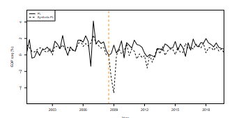

<!-- _class: lead -->

# Title of your presentation
### Subtitle of your presentation

**Your Name**
Department of International Economic Relations

 

University of Information Technology, VNU-HCM (UIT)

---

## Contents

1. **Motivation**
2. **Research gap & Aim of the paper**
3. **Theoretical background**
4. **Methodology**
5. **Data**
6. **Results & Discussion**
7. **Further research & Limitations**

---

## Motivation

- XYZ — your text
- (...your text)
- XYZ — your text
- tbc ...

> Dùng `<!-- _class: lead -->` ở slide để chỉ tiêu đề lớn không có thanh navy (cho slide chuyển mục).

---

## Research gap & Aim of the paper

To insert a table:

**Table:** Summary statistics of XX

| Country | Mean X | Min X | Max X |
|---|---|---|---|
| AT | 0.29 | 0.28 | 0.30 |
| BE | 0.27 | 0.25 | 0.29 |
| BG | 0.23 | 0.20 | 0.28 |

Source: own elaboration based on ...

---

## Theoretical background

To insert an equation (KaTeX):

$$
Y = \beta_0 + \beta_1 X + \epsilon \qquad (1)
$$

- Inline math: giá trị kỳ vọng $\mathbb{E}[Y\mid X]$ ...
- Giải thích biến: $\beta_0$ — hệ số chặn, $\beta_1$ — hệ số góc, $\epsilon$ — nhiễu.

---

## Methodology

Your text

**Bước 1 — ...**
- your text

**Bước 2 — ...**
- your text

---

## Methodology — sơ đồ quy trình (Mermaid → SVG)

Sửa sơ đồ trong <code>diagrams/methodology.mmd</code> rồi render lại: 
<code>npx -y @mermaid-js/mermaid-cli -i diagrams/methodology.mmd -o diagrams/methodology.svg -c diagrams/mermaid-config.json -b transparent</code>

---

## Data

Your text

**Nguồn dữ liệu:** ... · **Khoảng thời gian:** ... · **Số quan sát:** ...

---

## Results & Discussion

Figure: XYZ — Source: Authors' calculations &nbsp;·&nbsp; thay ảnh ở <code>assets/figure.png</code>

---

## Further research & Limitations

- **Limitation 1** — your text
- **Limitation 2** — your text
- **Future work** — your text

---

## References

1. Author, A. (Year). *Title of the work.* Journal/Publisher.
2. Author, B. (Year). *Title of the work.* Journal/Publisher.

Mẹo: nếu nhiều tài liệu, tách thành "References I", "References II" trên nhiều slide.

---

<!-- _class: lead -->

# Thank you for your attention

**Your Name**
your.email@email.com

University of Information Technology, VNU-HCM (UIT)
