<!-- _class: lead cover -->
<!-- _paginate: false -->

# Title of your presentation
### Subtitle of your presentation

**Your Name**
Department of International Economic Relations

 

University of Information Technology, VNU-HCM (UIT) · January 14, 2026

---

## Contents

1. **Motivation**
2. **Research gap & Aim**
3. **Theoretical background**
4. **Methodology**
5. **Data & Results**
6. **Further research & Limitations**

Slide chuyển mục giữa các phần: dùng <code>&lt;!-- _class: divider --&gt;</code>.

---

<!-- _class: divider -->

1

# Motivation

Bối cảnh · vấn đề · vì sao đề tài quan trọng

Phần 1

---

## Motivation

- XYZ — luận điểm chính của bạn.
- Dùng **strong** cho thuật ngữ, *em* cho nhấn xanh, `code` cho ký hiệu.
- Bullet có marker gradient tự động.

**Box (.box):** dùng cho ý chính / câu hỏi nghiên cứu / định nghĩa.

**Warn (.warn):** dùng cho lưu ý / cảnh báo / ngoại lệ.

---

## Research gap & Aim — bảng

**Table:** Summary statistics of XX

| Country | Mean X | Min X | Max X |
|---|---|---|---|
| AT | 0.29 | 0.28 | 0.30 |
| BE | 0.27 | 0.25 | 0.29 |
| BG | 0.23 | 0.20 | 0.28 |

Source: own elaboration based on ...

---

## Theoretical background — công thức

$$
Y = \beta_0 + \beta_1 X + \epsilon \qquad (1)
$$

- Inline math: giá trị kỳ vọng $\mathbb{E}[Y\mid X]$ ...
- Giải thích biến: $\beta_0$ hệ số chặn, $\beta_1$ hệ số góc, $\epsilon$ nhiễu.

---

## Methodology — bố cục 2 cột & flow

**Cột trái (.grid2)**
- ý a
- ý b

Input

▼

Xử lý

▼

Output

2017→
2021→
2026

---

## Methodology — sơ đồ (Mermaid → SVG)

Sửa sơ đồ trong <code>diagrams/methodology.mmd</code> rồi render lại: 
<code>npx -y @mermaid-js/mermaid-cli -i diagrams/methodology.mmd -o diagrams/methodology.svg -c diagrams/mermaid-config.json -b transparent</code>

---

## Data & Results — pipeline / mono

step 1 -> load data 
step 2 -> transform 
step 3 -> model -> output

&nbsp;&nbsp;c0&nbsp;c1&nbsp;c2 
r0[&nbsp;●&nbsp;&nbsp;·&nbsp;&nbsp;·&nbsp;] 
r1[&nbsp;●&nbsp;&nbsp;●&nbsp;&nbsp;·&nbsp;]

**Nguồn dữ liệu:** ... · **Khoảng thời gian:** ... · **Số quan sát:** ...

---

## Further research & Limitations

- **Limitation 1:** your text
- **Limitation 2:** your text
- **Future work:** your text

> Blockquote: dùng cho thông điệp kết / trích dẫn nổi bật.

---

## References

1. Author, A. (Year). *Title of the work.* Journal/Publisher.
2. Author, B. (Year). *Title of the work.* Journal/Publisher.

Mẹo: nếu nhiều tài liệu, tách thành "References I", "References II" trên nhiều slide.

---

<!-- _class: lead -->

# Thank you for your attention

**Your Name**
your.email@email.com

University of Information Technology, VNU-HCM (UIT)
